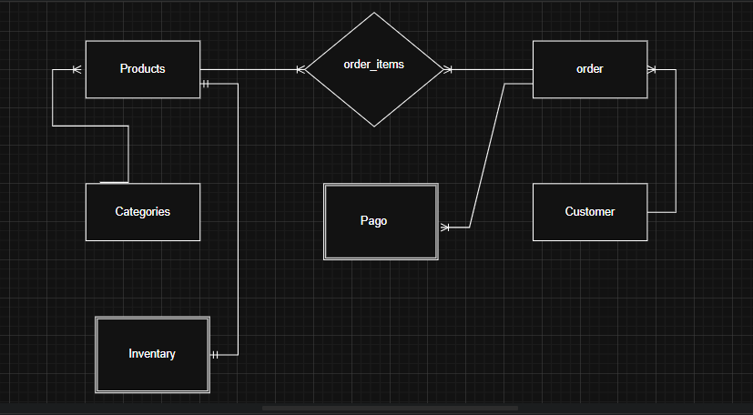

# E-commerce Database - Proyecto Módulo 3

Este proyecto consiste en el diseño e implementación de una base de datos relacional para un E-commerce (Skin Care). Incluye el modelado ER, la creación del esquema, la carga de datos y consultas escenciales de un negocio.

## Estructura del Repositorio
* `/sql/schema.sql`: Definición de tablas, restricciones e índices.
* `/sql/seed.sql`: Datos de prueba para validación.
* `/sql/queries.sql`: Consultas KPI y transacción de venta.
* `/docs/er.png`: Diagrama Entidad-Relación.

##  Modelo Entidad-Relación

## Requisitos e Instalación
1. Clonar el repositorio.
2. Ejecutar `schema.sql` en su gestor de base de datos (PostgreSQL/MySQL).
3. Ejecutar `seed.sql` para poblar las tablas.
4. Las consultas de negocio se encuentran en `queries.sql`.

## Consultas de Negocio Implementadas
* Búsqueda de productos por nombre y categoría.
* Reporte de ventas mensuales por categoría.
* Listado de productos con stock bajo (umbral < 10).
* Identificación de productos sin ventas (Stock muerto).
* Transacción segura de creación de orden con descuento de inventario.

---
**Desarrollado por:** [Michele Ortúzar]
**Repositorio:** [Repositorio del Proyecto: Ecommerce DB M3](https://github.com/MicheleOrtuzarT/ecommerce-db-m3.git)
-- Proyecto finalizado enero 2026--